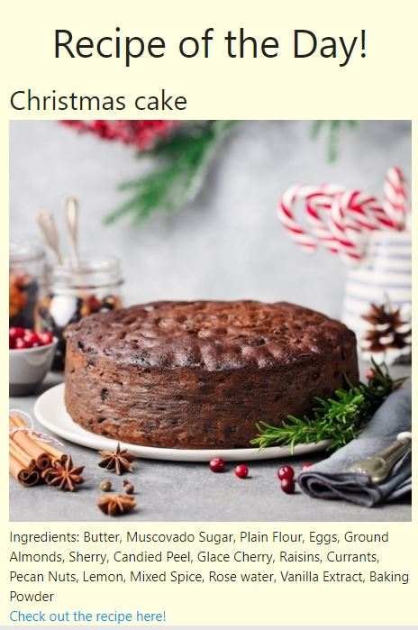
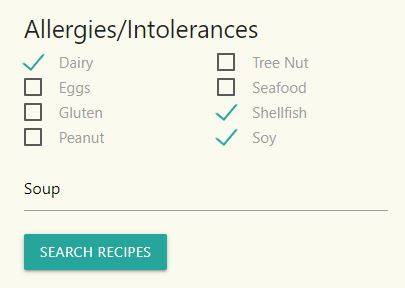
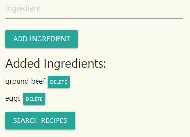
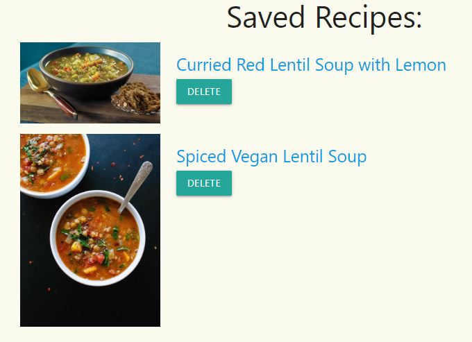

# Alan Parsons Projekt
Bootcamp Project 1

## About This Application
This app is designed to allow the user to search for recipes in two ways, using keywords and intolerances, or by using
a list of ingredients already owned. The user can also save favorite recipes for later use! Some other cool features
include: a recipe of the day, a joke of the day and dark mode. Here are some of the features:

### Recipe of the day:

### Search by Intolerance:

### Search by ingredients:

### Saved Recipes:

## Technology Behind the App

### API's used:
We used two database API's for searching and displaying recipes. These include:  
https://spoonacular.com/food-api The only food API you'll ever need.  
https://www.themealdb.com/api.php A free meal/recipe database.

For styling, we used the following CSS API:  
https://www.materializecss.com
A modern responsive front-end framework based on Material Design

We also used two library API's to add functionality to our JS coding:  
https://mootools.net a compact javascript framework  
https://jquery.com/ a fast, small and feature rich JavaScript Library

## Mission Statement:
As people who are alive and like to stay alive- food is necessary to this goal.
However, some people have allergies or sensativities to some types of food and that is no bueno!
So we created this app to help people figure out how to cook food, buy food and avoid foods 
they may be alergic or sensitive to.

